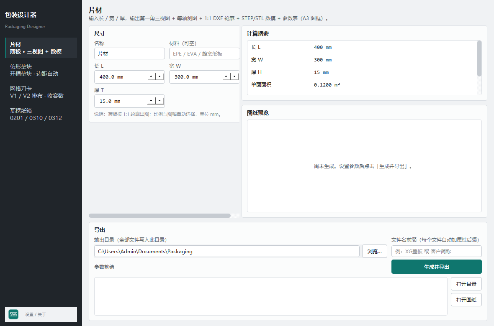
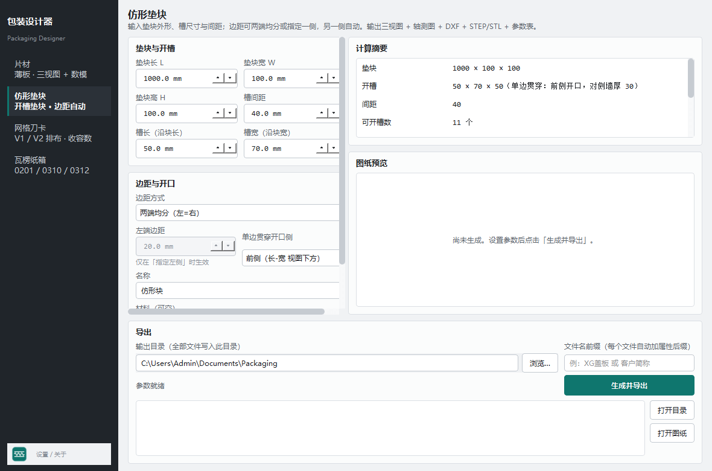
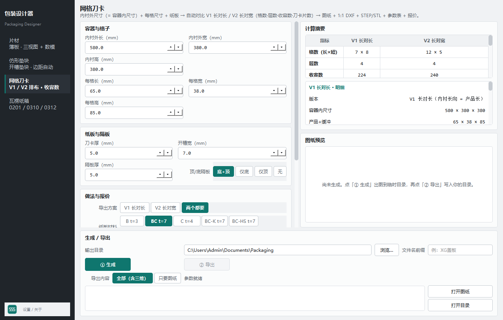
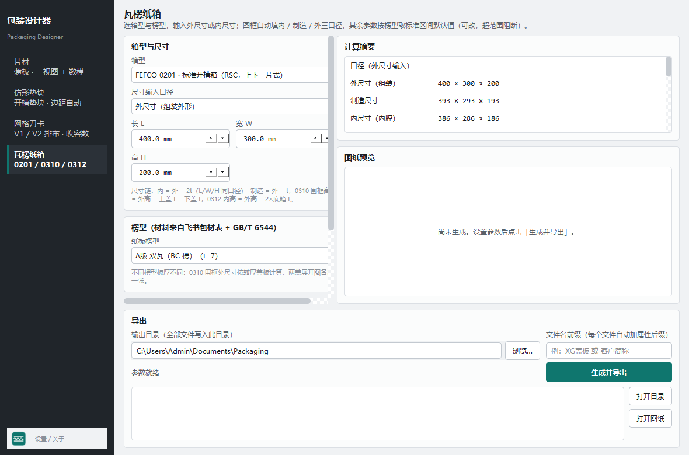

# 包装设计器 Packaging Designer

面向瓦楞纸包装的**参数量出图工具**：一次输入尺寸，直接得到可下厂的 A3 图纸、1:1 刀模图、三维数模与参数表。

四个模块：**片材**（薄板）、**仿形垫块**（开槽垫块）、**网格刀卡**（刀卡网格）、**瓦楞纸箱**（FEFCO 0201 / 0310 / 0312）。

**v1.0.1 新增**：按飞书口径的**报价**（面积 / 单价 / 金额 / 每套 / 总价）· **比例按图幅自适应**（可手动覆盖）· **先生成再导出**两段式流程 · 材料表补 **AA 双瓦** · 表单表格化 + 分段按钮（无下拉）· 图纸标题进图框 + 生成人可配。

**v1.0.13 修复（三处标注干涉，按现场截图逐一核对）**

- **网格刀卡 · 折边折弯线改点划线**：俯视图里折边的根部（贴刀卡料面那一侧）是**折弯线**，画成实线会被读成「裁断」；现按 GB 点划线表达，其余三边（料面投影边 + 展开料自由端）仍是裁切实线。刀卡本体棱线在折弯线那一小段**断开**，否则实线会把点划线盖住。折弯线在图上只有板厚 t 那么长（1:4 时约 1.25mm），改用加密点划线（周期 4.9pt），保证看得出「划—点—划」。
- **网格刀卡 · 高度/槽深标注按国标重排**：短卡侧视的高度/槽深尺寸挪到图形**下方**（图形之外）；长卡侧视的高度尺寸贴本体右端（+6）而不再排到 +15——原来会被短卡视图的尺寸线**横穿**（GB/T 4458.4：尺寸线不得相交）；短卡视图整体右移一个「长卡展开料伸长量」，把长卡尺寸列让开。
- **网格刀卡 · 版面**：俯视图上方的尺寸带占位改为**纸面绝对值**（按比例缩的占位在小比例时几乎归零，尺寸数字会顶到图幅标题行）；视图说明文字排进「长卡视图之下、技术要求之上」的空带，不再压长卡的高度尺寸列；技术要求按 168mm 折行，不再伸进右下标题栏。
- **0312 天盖尺寸不再进轴测图**：天盖图的竖向尺寸列从「天盖右侧」改排到「底箱 / 天盖两图之间的间隔」里（数字放尺寸线左侧），大箱 1:20 时也不会伸进右侧轴测图；顺带 400×300×200 的比例从 1:10 放宽到 **1:8**。
- **同类问题全量排查并修掉**：0201（「内摇盖深」尺寸压版面字）、0310（「围框（×1）」压竖向尺寸线）、片材（「大字说明」与「字体」完全叠字）、仿形块（槽宽数字骑在尺寸线上）——现全部 **0 压线 / 0 叠字 / 0 尺寸线相交 / 0 撞标题栏**（5 条管线 × 16 个算例）。
- **检测器升级（这轮的真正教训）**：旧检查器把尺寸线当成**包围盒对角线**（尺寸线是 annotate 的 FancyArrowPatch，不在 ax.lines 里），所以「尺寸线相交」「文字被尺寸线穿过」这两类**一直检不出来**；现在改为取真实线段，并新增**尺寸线相交/穿线**与**正文禁入区（标题栏）**两道检查。

**v1.0.10 修复（折边三处收尾，按现场指出）**

- **俯视图**：折边根部贴着卡端的那截**短连接线已裁掉**——立板顶边窄条完整地偏移在距卡端 30 处，与卡体之间只隔折弯虚线，无任何实线相连。
- **侧视图**：折边外伸段**端部已封口**（补两端竖直端边）；「35」标注移到折边外端外侧，不再与 85/42.5 尺寸带、折弯虚线干涉。
- **轴测图**：折边立板与刀卡本体**同厚列、向容器内折 30**——本体端部段被立板替代（同一块料折 90°，不再两块板叠画），模型零体积穿插；折边与相邻长卡的接触为**顶靠**（缓冲限位的本意），技术要求第 8 条已写明。
- 几何基线比对改为**关折边跑**（折边是新增几何，属有意变更），其余几何零回归；折边正确性由 fold_conn_check / 3D 穿插检查专管。

**v1.0.9 修复（折边视图表达，按用户复核定案）**

- **俯视图 = 折叠后状态**：折边与刀卡**垂直**、形如大写 L——自原卡端折 90°、向容器内侧伸净长 30，宽 = 板厚 t；折弯线（虚线）在原卡端、横跨板厚；卡端不画实线（材料连续，无接缝）；L 立边三条可见边为实线。
- **侧视图 = 展开状态**：底图同无折边侧视图，两端**端面竖线改虚线（折弯线）**，折弯线之外各外伸 **35（=30+t）**，高度与刀卡相同；标注写明「展开 xxx（两端各 35 = 净长 30+t，虚线=折弯线）」。
- 3D 折边实体与俯视图一致（垂直立板）；检查器 fold_conn_check 同步 L 形口径（四角闭合 + 不横穿）。

**v1.0.8 修复（折边口径，按现场图 3 定案）**

- **折弯线就在原刀卡两端**（那条点划线就是原卡端位置），折弯线之外再延伸 **30 + 板厚 t** 为折边——t 计入折弯料厚，供应商才折得出净长 30 的立边。
- **接缝线彻底清除**：卡端与折边是同一块纸板，**不再画任何实线分隔**；折边两条长边与刀卡棱线连成一条贯通线，只有折边外端是裁切实线。
- 俯视图（折叠后状态）、两张刀卡侧视图（展开）、轴测图、1:1 展开 DXF 四处口径一致；3D 实体贴在卡端之外、与板体零重叠。
- 新增客观检查 `fold_conn_check.py`（逐块折边：四角闭合 + 不横穿别的板）与 `fold_debug_plot.py`（按线型着色核对）；检查器直接复用图纸的坐标变换，杜绝两套口径。

**v1.0.7 修复（折边画法，现场指出）**

- **折边几何附着面改正**：折边此前从刀卡**中心线**起画 → 折边的两条边会横穿刀卡本体，看起来像「把板切断的接缝」。现在折边**从容料面起折**（贴板面），轮廓按「料面 → 卡端面 → 折边侧边 → 折边外端」一条线连通，**四角闭合**。
- **折弯线画在附着段**：折弯线（点划线）只画在「折边宽度 × 板厚」那一段上，不再横跨整块板。
- **3D 实体同步**：折边实体同样改为**附着料面**（此前偏了半个板厚，折叠后与板体体积重叠）；实测 38 块折边实体与板体**零重叠**。
- **新增两道客观检查**（不靠肉眼）：
  · `fold_conn_check.py` —— 逐块折边断言「四角闭合 + 端点不横穿别的板」
  `fold_debug_plot.py` —— 按线型着色出图（黑=裁切线/蓝=折弯线/红=折边外端）＋折边带横穿检测
- **新增打包产物校验** `build_release.py`：本轮曾出现 PyInstaller 在内存紧张时取 Qt 信息失败、导致包缺 `qwindows.dll`（装完报 no Qt platform plugin）——现在打包后**强制校验 11 项关键文件**，缺任何一项直接判失败，不允许进入安装/发布。

**v1.0.6 新增：刀卡两端 30mm 折边（边距 ≤ 20mm 触发）**

- **触发**：该方向的**边距（卡端→第一个槽）≤ 20mm** 时，该方向刀卡**两端各加 30mm 折边**（阈值/长度可在网格页「两端折边」卡里改，也可整体关闭）。
- **展开**：折边是同一块纸板的延伸 → **展开长 = 卡长 + 2×30**；**折弯线在距两端 30mm 处**（= 原卡端位置），DXF 里单独放 `FOLD` 图层（点划线）。
- **折叠后**：绕竖直折弯线折 90°，折边成为垂直于刀卡平面的竖板（30 × 卡高 × 板厚），朝**容器中线**方向折（保证折边落在箱内、不越出内尺寸）。
- **图纸**：**俯视图**画出 30×t 折边矩形、卡端边改为折弯线（点划线）；**两张刀卡侧视图**按展开画（两端多出 30 + 折弯线 + 「展开 xxx」标注）；**轴测图**把折边作为实体画出（与刀卡一起参与遮挡）。
- **摘要**：新增「两端折边 / 折边规格 / 展开长（含折边）/ 折边增加用纸」四行，V1-V2 对比表也加了「两端折边」「展开长」两行。
- **报价**：仍按飞书口径（面积 =(长+A)(宽+A)×张数）算，**折边增加的纸面积单列一行**，不改变已验证的飞书公式。

**v1.0.5 修复**：

- **P0**：点「图框字段…」保存后弹 `AttributeError: 'FrameDialog' object has no attribute 'Accepted'`（PySide6 下不能从实例取 Accepted）→ 改用 `QDialog.DialogCode.Accepted`，并加了这条崩溃的回归用例。
- **图框「图样」栏可填**：新增 **图样名称 / 图样代号 / 版本 / 材料** 四项，**留空 = 用程序自动值**（占位提示会显示自动值长什么样），填了就按你填的写进图框右下角。设置页同步补上这四项。

**v1.0.4 修复（现场反馈「导出目录不听」+「图框字段没处填」）**：

- **导出目录**：目录字符串先清洗（粘贴带引号/前后空格/`~` 都能用）并回填规范路径；写前做权限预检；目标文件被占用时**自动改名 `xxx (2).pdf` 继续导出，不再丢件**；导出后逐个复查落地；导出过的目录自动记成下次默认。
- **打开入口**：「打开目录」改为永远打开**当前输入框里的目录**（原来是建页时的旧值，所以看起来「不听」）；「打开图纸」改为打开**导出副本**（原来是临时目录里的原件）。本机实测 **.pdf 没有默认打开程序**，此前点了没有任何反应 —— 现在会**自动改用资源管理器定位并说明原因**（有关联的 .png/.dxf 直接打开）。
- **图框字段**：新增**「图框字段…」按钮**（就在「生成/导出」卡片里），单位名称 / 生成人 / 设计 / 制图 / 校对 / 审核 / 工艺 / 标准化 / 批准 / 日期 **十个字段**都可填；**日期留空 = 生成当天**。修正了旧版字段串位（填的「审核」被画到「校对」格、审核格永远空白、日期从未传值）。

**v1.0.3 修复**：仿形块比例算错（`min` 应为 `max`，导致长条块按 1:2 画成 1.25 m 宽、冲出图框并压线）· 视图名/页脚按纸面偏移（不再随比例贴到线上）· 板面文字放不下就省略（窄粘舌、小角片不再压折线）· 尺寸链去重（内外/制造尺寸不再重复出现）· 网格摘要改**横向对比表**（V1 / V2 两列并排）· 生成过程**分阶段提示**（正在出图纸 / 正在建三维 / 方案 1/2 + 已用秒数）· 新增「导出内容：全部（含三维）/ 只要图纸」——网格两套方案只出图纸实测 **9.6 s**（全套 21.3 s）。

**v1.0.2 修复**：长任务（网格刀卡约 20 秒）期间界面**给出明确进度**——按钮变「生成中…」、进度条可见、完成后显示耗时；预览区提示改为两段式说明。新增**崩溃/错误日志**（`%LOCALAPPDATA%\PackagingDesigner\` 下 `crash.log` 与 `error.log`），程序异常退出时不再无痕。修复结果表分组行数计算错误（分组标题行未计入导致部分行不显示）。



---

## 能出什么

每个模块一次生成一整套文件，命名 =「你填的前缀 + 属性后缀」，全部落在你选的目录里：

| 属性后缀 | 内容 |
|---|---|
| `图纸-…_A3.pdf / .png / .svg` | A3 图纸：展开图（刀模图）+ 等轴测图 + 右下角 GB 图框与标题栏 |
| `…_1-1.dxf` | 1:1 刀模/轮廓 DXF（切线与压线分层） |
| `三维模型-*.step / .stl` | 三维数模（面板厚度实体；箱类含闭合/组装与开盖/分解两态） |
| `轴测图-*.png / .svg` | 独立轴测图 |
| `参数表.md` | 尺寸链、用纸面积、格数/层数/收容数、报价等全部计算值 |



## 四个模块的输入

**片材**：长 / 宽 / 厚（+ 名称、材料）。
输出第一角三视图（俯视/主视/侧视 + 等轴测）+ 1:1 轮廓 DXF + STEP/STL + 参数表。
比例默认**自动**：按图幅实际可用区取「放得下的最大比例」（含放大档 2:1 / 5:1）；也可手动填 1:x，画不下时只提示不阻断。

**仿形垫块**：垫块 长/宽/高、槽 长/宽/深、槽间距；边距可「两端均分」或「指定左侧、右侧自动」；单边贯穿槽可指定开口侧（默认前侧）。
公式与口径来自公司《包材需求各部门汇总》「仿形卡槽」行：可开槽数 n = ⌊(L + 间距)/(槽长 + 间距)⌋，边距总和 = L − n×槽长 − (n−1)×间距。

**网格刀卡**：内衬外尺寸（= 容器内尺寸）、每格尺寸（产品 + 缓冲）、刀卡厚度、开槽宽度、隔板厚度、顶/底隔板选项（无 / 仅底部 / 仅顶部 / 底部+顶部，层间隔板恒有）。
自动算出**两种排布**并同屏对比：`V1 长对长`、`V2 长对宽` —— 格数（长×短）、层数、收容数、长/短刀卡片数、边距、堆叠高度；可只导一种或两种都导。
公式：n = ⌊(内尺寸 − 3t)/(每格 + max(t, 6))⌋；边距 ≥ 6 mm 为硬约束；长边张数 = 短向格数 + 1。
自动按飞书「网格」表口径出**报价**：面积 =(长+A)(宽+A)×张数，总价 = Σ面积×单价 + 人工费（A 默认 15 mm，可改）。



**瓦楞纸箱**：选箱型 → 选楞型 → 填外尺寸或内尺寸。

| 箱型 | 结构 | 楞型选择 | 尺寸口径 |
|---|---|---|---|
| FEFCO 0201 | 标准开槽箱 RSC（上下一片式） | 纸板楞型 ×1 | 内 / 外 / 制造三口径联动 |
| FEFCO 0310 | 围框 + 两盖（端对端双盖） | 围框 / 上盖 / 下盖 ×3（可锁同款） | 围框外 = 盖内 − 2×间隙；围框高 = 外高 − 上盖 t − 下盖 t |
| FEFCO 0312 | 底箱 + 平顶罩盖 | 底箱 / 天盖 ×2 | 底箱外 = 盖内 − 2×间隙；内高 = 外高 − 2×底箱 t |

- 楞型来自**公司包材汇总表**：A版单瓦（B）、A版双瓦（BC）、超密封 K 单瓦（C）、超密封 K 双瓦（BC-K）、高强超密封（BC-HS）、**AA 双瓦（AA）**、ABC 三瓦、AAA 三瓦，共 8 种；厚度 / 边压 / 耐破 / 单价齐全，界面用一行紧凑按钮直接点选。
- 工艺参数（接舌宽、摇盖加放、内摇盖折减、开槽宽、盖-围框间隙、罩深）按楞型给**标准区间默认值**并显示区间来源；超范围直接阻断，不会画出不合规范的箱子。
- 图框自动填**内尺寸 / 制造尺寸 / 外尺寸**三口径。
- 上下盖楞型不同时，两张盖展开图分别出图、分别标注。



## 报价（飞书口径）

瓦楞纸箱与网格刀卡直接按公司《包装物料成本报价表》的公式出价，公式**照抄飞书单元格**，并用表内 16 组原值做过逐位回归：

| 件型 | 面积公式（A = 边料余量，mm） |
|---|---|
| 开槽箱 0201 / 标准纸箱 | `(长+A+宽+A+80) × (宽+A+高+A+40) / 1e6 × 2` |
| 围框 0310 | `(长+A+80+宽+A) × (高+A+40) / 1e6 × 2`（三瓦用 +100 / +50） |
| 盖 / 天盖 / 地盖 / 托盘 | `(长+A+2(高+A)+40) × (宽+A+2(高+A)+40) / 1e6` |
| 刀卡 / 隔板 | `(长+15) × (高+15) × 张数 / 1e6` |

- **A 默认**：单瓦 15 / 双瓦 20 / 三瓦 30（表内经验值），界面可切「按楞型默认 / 手动」。
- **总价** = Σ(面积 × 材料单价) + 人工费（元/套）× 套数；结果同时出现在界面摘要、图纸参数表与 `.md` 里。
- **材料单价**（元/㎡，来自「隔板」表）：B 2.06 / BC 2.68 / C 3.85 / BC-K 6.33 / BC-HS 10.80 / AA 11.25 / ABC 15.93 / AAA 26.80。

## 工作流程

**① 生成** → 出图到程序临时目录（`%TEMP%\PackagingDesigner\…`），右侧即时预览、下方列出全部文件；
**② 导出** → 按「前缀_属性后缀」复制到你选的目录。改了参数未重新生成时，导出按钮自动禁用并提示，避免导出过期图纸。

**各模块耗时参考**（本机实测，含三维建模）：片材 ≈1.5 s · 仿形垫块 ≈1 s · 瓦楞纸箱 ≈1.6 s · **网格刀卡 ≈21 s**
（网格要建两套格架：V1+V2 共 18 个文件 + 几十万三角面，生成中按钮会显示「生成中…」并走进度条。）

## 版面自检（开发用）

`python layout_check.py` 做两件客观检测，不靠肉眼：

1. **文字压线**：把每个文字对象的显示包围盒与同轴折线段做相交检测（带白底遮罩的标注自动跳过），报出「哪句话压了哪条线」；
2. **比例效率**：实际用比例 vs 该区域能容纳的最大档位，差值即「浪费档位数」。

当前结果：**片材 / 仿形垫块 / 网格 / 纸箱 0201·0310·0312 各尺寸档位，压线 0 处、浪费 0 档**。

## 出问题时怎么查

程序把两份日志写在 `%LOCALAPPDATA%\PackagingDesigner\`：

| 文件 | 内容 |
|---|---|
| `crash.log` | 会话启动记录 + **致命崩溃栈**（段错误 / abort / fail-fast 都能抓到） |
| `error.log` | Python 层未捕获异常（同时会弹窗提示） |

> 提示：图纸/目录打开依赖系统文件关联。若本机没有 PDF 阅读器，程序会改为在资源管理器中定位文件并给出提示，不会静默失败。

反馈问题时把 `crash.log` 一起发出来即可定位。

## 制图规范

- 图框：GB 留装订边版式（左 25 / 其余 5，分区带 1-8 / A-F），标题栏为 GB/T 10609.1（ISO 7200）网格化版式 180×56。
- 第一角投影；等轴测图只画可见外轮廓线（遮挡关系按拓扑排序 + 共面小面积优先）。
- 比例按 GB/T 14690 数系**按图幅自动选档**（含放大档 2:1 / 5:1），标题行内嵌「比例 1:x（自动/手动）」；尺寸线避让、尺寸文字白底遮罩。
- 图纸标题与副标题落在图框内框之内，不与分区带/图框线相碰；副标题含「生成：<生成人>」，生成人可在「设置」里改（默认 包装周哥）。
- 材料口径参考 GB/T 6543-2025、GB/T 6544；箱型按 FEFCO 官方目录口径。

## 安装与运行

下载 `包装设计器-1.0.1-setup.exe`（amd64，约 108 MB），双击安装。**免管理员**：默认装到 `%LOCALAPPDATA%\Programs\PackagingDesigner`，自带 Python 运行时与全部依赖，目标机无需装任何东西。

- 开始菜单 / 桌面快捷方式自动创建，控制面板可正常卸载。
- 首次出图约 2–3 秒/套（含三维建模）；网格刀卡首次会多花几秒加载几何内核。

## 从源码构建

```bat
:: 1) 依赖（Python 3.11+，建议 3.13）
python -m pip install PySide6 matplotlib ezdxf cadquery-ocp pillow pyinstaller

:: 2) 源码直接运行
python app.py

:: 3) 打包（onedir）
pyinstaller --noconfirm --clean packaging-designer.spec
::    产物：dist/PackagingDesigner/PackagingDesigner.exe

:: 4) 出安装包（需 NSIS 3.x）
cd installer && makensis setup.nsi
```

自检：

```bat
python reg_check.py        :: 几何回归：与已交付样箱逐位比对（需评审用副本，见脚本内路径说明）
python check_gui.py        :: GUI 端到端：四模块各跑一次真实生成（离屏，不弹窗）
```

## 目录结构

```
app.py                  入口（QApplication + 主窗口 + --shot/--selftest 自检开关）
backend.py              统一后端：即时计算（plan）与出图（export）分离
flute_lib.py            楞型库：厚度/边压/耐破 + 各楞型标准区间
core/                   几何内核（可独立使用）
  sheet_core/draw/make      片材
  block_core/model/draw     仿形垫块
  grid_core/model/draw      网格刀卡
  box0210_* box0201_* box0310_* box0312_*   纸箱（含 3D 面板、遮挡排序渲染）
  dwgframe.py               GB 图框与标题栏
ui/                     界面（PySide6）：theme / widgets / pages / dialogs / settings
resources/              图标（app.ico 等）
installer/setup.nsi     NSIS 安装脚本
docs/screenshots/       界面截图
```

## 关于

- 作者：**周豪 · 供应链管理部**
- 开源地址：<https://github.com/hawchou1995/packaging-designer>
- 许可：MIT（见 [LICENSE](LICENSE)）

> 图纸为参数量出图结果，用于打样与工艺沟通；正式开模前请按厂方刀模图复核。公司名称、签署栏可在「设置」中维护。
